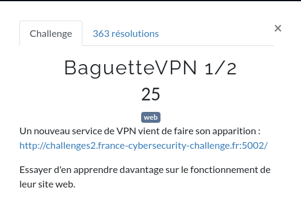
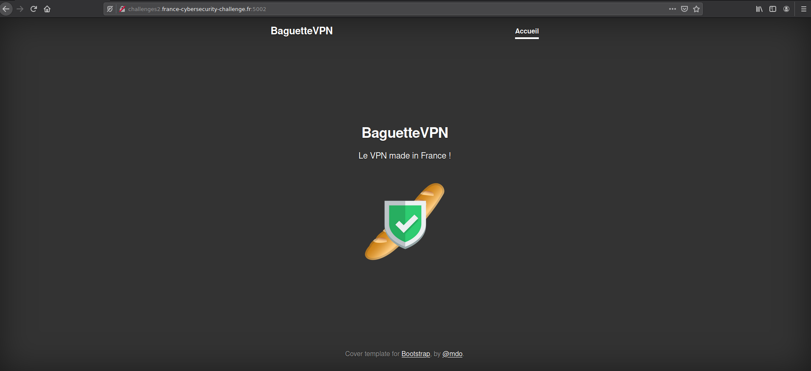
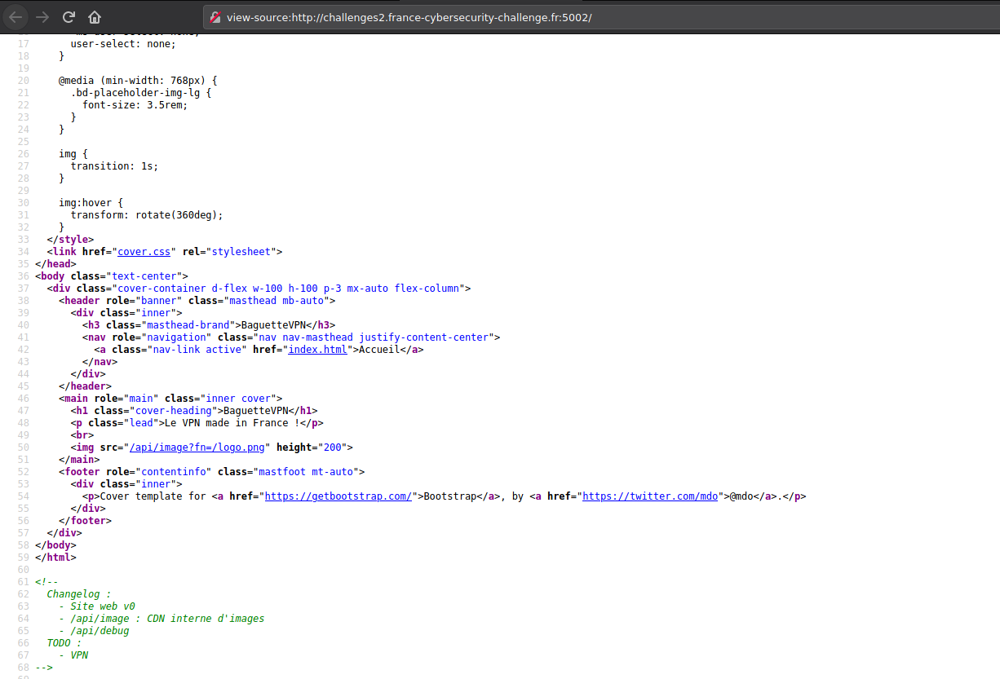
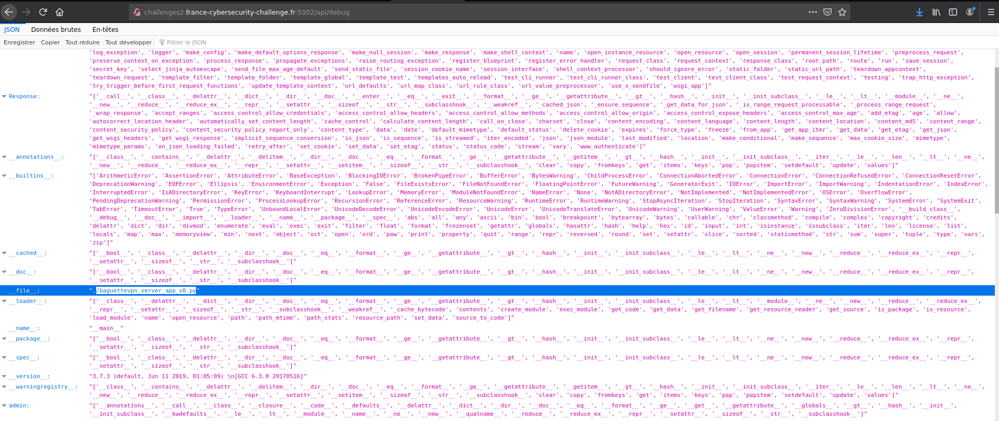

# Baguette VPN (1/2)




# Baguette VPN. Le VPN de l'avenir

Dans ce challenge web, nous avons le site d'un service de [VPN](https://fr.wikipedia.org/wiki/R%C3%A9seau_priv%C3%A9_virtuel) (Baguette VPN).
Ce challenge est en 2 parties : une simple (exposée ici) et une plus compliquée.




Jusqu'ici, rien de foufou.

Regardons le code source pour voir si on trouve des choses interessantes.



Nous voyons ici un commentaire avec 2 routes API:
- `/api/image` Route vers le [CDN](https://fr.wikipedia.org/wiki/R%C3%A9seau_de_diffusion_de_contenu)
- `/api/debug` Route [WTF](https://fr.wikipedia.org/wiki/Liste_de_termes_d%27argot_Internet#W,_X,_Y,_Z) de debug

Regardons ce que nous apprend la route `/api/debug` :



On remarque (mais il faut ouvrir les yeux dans tout ce rose) qu'il y a un fichier qui s'appelle [baguettevpn_server_app_v0.py](ressources/baguettevpn_server_app_v0) qui, comme son nom l'indique, pourrait être le code source du serveur.

Téléchargeons-le et ouvrons-le :

```python
# /usr/bin/env python3
# -*- coding:utf-8 -*-
# -*- requirements:requirements.txt -*-

# Congrats! Here is the flag for Baguette VPN 1/2
#   FCSC{e5e3234f8dae908461c6ee777ee329a2c5ab3b1a8b277ff2ae288743bbc6d880}

import os
import urllib3
import sys
from flask import Flask, request, jsonify, Response
app = Flask(__name__)


@app.route('/')
def index():
    with open('index.html', 'r') as myfile:
        return myfile.read()


@app.route('/api')
def api():
    return Response('OK', status=200)


@app.route("/api/image")
def image():
    filename = request.args.get("fn")
    if filename:
        http = urllib3.PoolManager()
        return http.request('GET', 'http://baguette-vpn-cdn' + filename).data
    else:
        return Response('Paramètre manquant', status=400)


@app.route("/api/secret")
def admin():
    if request.remote_addr == '127.0.0.1':
        if request.headers.get('X-API-KEY') == 'b99cc420eb25205168e83190bae48a12':
            return jsonify({"secret": os.getenv('FLAG')})
        return Response('Interdit: mauvaise clé d\'API', status=403)
    return Response('Interdit: mauvaise adresse IP', status=403)


@app.route("/api/debug")
def debug():
    data = {}
    for k, v in globals().copy().items():
        if not isinstance(v, str):
            data[k] = str(dir(v))
        else:
            data[k] = v
    data['__version__'] = sys.version
    return jsonify(data)


@app.route('/<path:path>')
def load_page(path):
    if '..' in path:
        return Response('Interdit', status=403)
    try:
        with open(path, 'r') as myfile:
            mime = 'text/' + path.split('.')[-1]
            return Response(myfile.read(), mimetype=mime)
    except Exception as e:
        return Response(str(e), status=404)


if __name__ == '__main__':
    app.run(host='0.0.0.0', port=os.getenv('FLASK_LOCAL_PORT'))
```

Regardons l'en-tête :

```python
# /usr/bin/env python3
# -*- coding:utf-8 -*-
# -*- requirements:requirements.txt -*-

# Congrats! Here is the flag for Baguette VPN 1/2
#   FCSC{e5e3234f8dae908461c6ee777ee329a2c5ab3b1a8b277ff2ae288743bbc6d880}
```

Le flag ce trouve ici.

```
FCSC{e5e3234f8dae908461c6ee777ee329a2c5ab3b1a8b277ff2ae288743bbc6d880}
```


