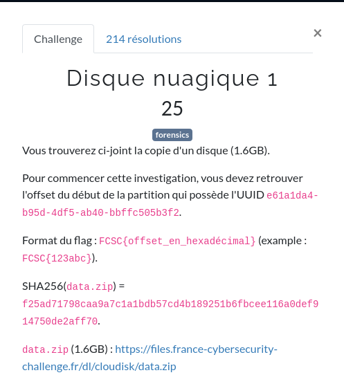

# Disque Nuagique (1/2)



Nous avons à disposition ici une archive contenant 2 volumes [EWF](https://en.wikipedia.org/wiki/EnCase).

[`data.zip`](ressources/data.zip)

# Etude

L'archive `data.zip` contient 2 volumes [EWF](https://en.wikipedia.org/wiki/EnCase) :

- disque.e01
- disque.e02

Il faut trouver l'offset d'une partition.

Montons donc disque.e01

```shell
kali@Tyrell:~/FCSC/FCSC2021/forensic/DisqueNuagique$ ewfmount disque.e01 disque
```

Nous allons extraire les chaînes de caractères de ce disque.

```shell
kali@Tyrell:~/FCSC/FCSC2021/forensic/DisqueNuagique$ strings disque/ewf1 > disque1.txt
```

Nous trouvons bien le volume en question à l'interieur de ce fichier :


On voit ici que ce volume est un volume chiffré.

Regardons avec la commande `parted` sur quel offset se trouve cette partition :

```shell
kali@Tyrell:~/FCSC/FCSC2021/forensic/DisqueNuagique$ sudo parted disque/ewf1
Warning: Unable to open /home/kali/FCSC/FCSC2021/forensic/DisqueNuagique/disque/ewf1 read-write (Permission non accordée).  /home/kali/FCSC/FCSC2021/forensic/DisqueNuagique/disque/ewf1 has been opened read-only.
GNU Parted 3.4                                                            
Using /home/kali/FCSC/FCSC2021/forensic/DisqueNuagique/disque/ewf1
Welcome to GNU Parted! Type 'help' to view a list of commands.
(parted) u                                                                
Unit?  [compact]? B                                                       
(parted) print                                                            
Model:  (file)
Disk /home/kali/FCSC/FCSC2021/forensic/DisqueNuagique/disque/ewf1: 10737418240B
Sector size (logical/physical): 512B/512B
Partition Table: msdos
Disk Flags:

Number  Start       End           Size          Type      File system  Flags
 1      1048576B    511705087B    510656512B    primary   ext2         boot
 2      512752640B  10736369663B  10223617024B  extended
 5      512753664B  10736369663B  10223616000B  logical
```

Nous avons notre partition logique chiffrée sur cette ligne :

```shell
 5      512753664B  10736369663B  10223616000B  logical
```

Si on transcrit l'offset de départ `512753664` en hexadécimal, on obtient `1e900000`

Le flag est donc

```
FCSC{1e900000}
```


