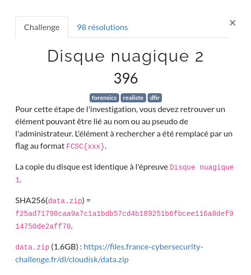

# Disque Nuagique (2/2)



Ce challenge est la suite de [Disque Nuagique 1/2](https://www.ecuri.es/disque-nuagique-1-2/)

# La suite

Nous avons vu précédemment que dans [data.zip](ressources/data.zip), nous avons 2 images :

- `disque.e01`
- `disque.e02`

Spoiler : Le disque e02 a la même structure que le disque e02.

Il est possible de monter les disques en les "mergeant".

```shell
kali@Tyrell:~/FCSC/FCSC2021/forensic/DisqueNuagique$ ewfmount disque.e0* disque
```

Nous avons vu que nous avons 2 partitions :
- 1 non chifrée : `/boot`
- 1 chifrée dont on en connait pas la clé.

Conentrons nous sur la première partition (celle non chiffrée).

Nous avons à l'intérieur une image [initrd](https://fr.wikipedia.org/wiki/Initrd).

Cette image est une image compressée. Décompressons là pour voir si on ne trouve pas un élément pouvant être lié au nom de l'administrateur.

```shell
kali@Tyrell:~/FCSC/FCSC2021/forensic/DisqueNuagique/Root$ mv initrd.img-4.19.0-14-amd64 initrd.img-4.19.0-14-amd64.gz
kali@Tyrell:~/FCSC/FCSC2021/forensic/DisqueNuagique/Root$ gunzip initrd.img-4.19.0-14-amd64.gz
```

Nous avons donc une image décomprssé.

Recherchons le [pettern](https://fr.wikipedia.org/wiki/Pattern) `FCSC` à l'intérieur pour voir si on ne trouve pas notre flag.

```shell
kali@Tyrell:~/FCSC/FCSC2021/forensic/DisqueNuagique/Root$ strings initrd.img-4.19.0-14-amd64 | grep FCSC
ssh-rsa AAAAB3NzaC1yc2EAAAADAQABAAABAQCugzXip0c9+5DUxpTsJV1s9kLjiF4+inMOzziGnc4uj1UpguzouJQ7S614xBWqCjD93GKSibD11S/x+t95KLxQh9iQeHSgtqT7eROSsrEoy8fY/XW75IR7GLBI/5dWmPMu/1Mo4q819GEVe8y9OrcWkTh46Ua027v5Q4ziE0PYzPW9orm8TaVDYZW0DZrGLliGGI+iXM3jQ+3PerROCG52HvQinq4NDq0Vq4dwfqhq85KOdTHaoGiZvJ/9Z/xv11odeTVEw6exhx8iECOrNS5OZsvpiKmVMmwnkuAjGcWGRMiPxMqpGvprlz4KEqHx8buB3pJ6F75mml+IpHCQ2iQt FCSC{0fb01eb22d4f812dcbdfcb}
```

Nous avons une clé [SSH](https://fr.wikipedia.org/wiki/Secure_Shell) publique avec comme nom d'administrateur, notre flag :

```
FCSC{0fb01eb22d4f812dcbdfcb}
```


