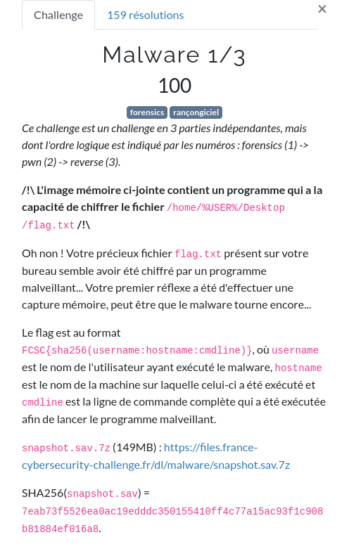
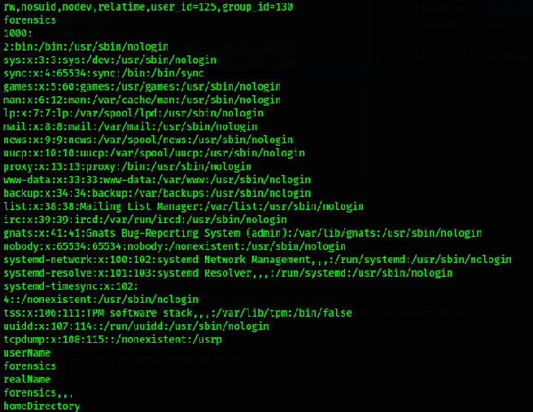
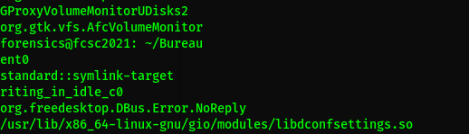

# Malware



Nous avons ici un [dump](https://fr.wikipedia.org/wiki/Dump) mémoire comme document de travail.

[`snapshot.sav.7z`](ressources/snapshot.sav.7z)

# Introspection

Executons la commande `strings` pour extraire toutes les chaines de caractères du fichier.

```shell
kali@Tyrell:~/FCSC/FCSC2021/forensic/malware$ strings snapshot.sav > snapshot
```

En ouvrant le document dans [VIM](https://fr.wikipedia.org/wiki/Vim), nous avons accès à pas mal d'infos.

Première étape, nous cherchons ici le username de l'utilisateur qui a executé le malware.

En cherchant un peu dans le [dump](https://fr.wikipedia.org/wiki/Dump), on tombe sur un extrait d'un `/etc/passwd`



On coit ici tout en haut, un user `forensics` qui a un uid 1000.

On a donc potentiellement notre username.

Deuxième étape, nous cherchons le `hotname`.

Sur les systèmes Linux, le hostname est affiché derrière le nom d'utilisateur suivi du caractère `@`.

Cherchons donc `forensics@` dans le [dump](https://fr.wikipedia.org/wiki/Dump) :



Nous voyons ici `forensics@fcsc2021: ~/Bureau`.

Le nom d'host est donc `fcsc2021`.

Troisième et dernière étape, nous cherchons la commande qui déclanche le malware.

En parcourant le [dump](https://fr.wikipedia.org/wiki/Dump), nous voyons plusieurs fois une commande avec `/bin/1 --client`.

Ce qui parait assez louche comme type de commande.

Nous allons voir si le user `forensics` a lancé une telle commande.

```shell
kali@Tyrell:~/Téléchargements$ cat snapshot | grep "client -i"
[00m$  /bin/1 --client -i 192.168.56.103
 /bin/1 --client -i 192.168.56.103
 /bin/1 --client -i 192.168.56.103
/bin/1 --client -i 192.168.56.103
[00m$  /bin/1 --client -i 192.168.56.10
/bin/1 --client -i 192.168.56.103
forensics@fcsc2021:~/Bureau$  /bin/1 --client -i 192.168.56.103
/bin/1 --client -i 192.168.56.103
 /bin/1 --client -i 192.168.56.103
 /bin/1 --client -i 192.168.56.103
[00m$  /bin/1 --client -i 192.168.56.103
```

BINGO !

Nous avons bien la commande `/bin/1 --client -i 192.168.56.103` lancé par le user `forensics` sur la machine dont le hostname est `fcsc2021`.

Faisons un hash `SHA256` avc la concaténation de ces 3 infos :

```php
echo hash('sha256', 'forensics:fcsc2021:/bin/1 --client -i 192.168.56.103');
34aa0f2895fc61bdfb26c47708d78c6b99db30dddaecaa93cf5a4ab5acb76923
```

Le flag est donc

```
FCSC{34aa0f2895fc61bdfb26c47708d78c6b99db30dddaecaa93cf5a4ab5acb76923}
```


