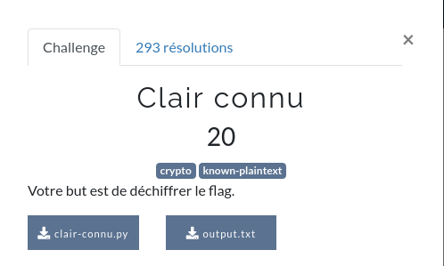

# Clair Connu





# Au départ

Dans ce super challenge, le but est de déchiffrer le flag.

Pour cela, nous avons 2 fichiers.

[clair-connu.py](ressource/clair-connu.py) et [output.txt](ressource/output.txt)

# Analyse

Dans le fichier `output.txt` nous avons le contenu suivant :

```
d91b7023e46b4602f93a1202a7601304a7681103fd611502fa684102ad6d1506ab6a1059fc6a1459a8691051af3b4706fb691b54ad681b53f93a4651a93a1001ad3c4006a825
```
En gros... Une suite hexadécimale.

Regardons maintenant ce qu'il y a dans [clair-connu.py](ressource/clair-connu.py)

```python
import os
from Crypto.Util.number import long_to_bytes
from Crypto.Util.strxor import strxor

FLAG = open("flag.txt", "rb").read()

key = os.urandom(4) * 20
c = strxor(FLAG, key[:len(FLAG)])
print(c.hex())
```

Les 3 premières lignes, 3 packages sont importés : `os`, `long_to_bytes` et `strxor`.

Ensuite, le script récupère le contenu d'un fichier `flag.txt` en mode binaire, et le contenu est stocké dans la variable `FLAG`.

La variable `key` contient une suite d'octets aléatoires répété 20 fois.

La variable `c` contient le résultat de l'opération XOR (Ou exclusif) entre le contenu de la variable `FLAG` (le flag donc) et la suite d'octets aléatoires contenue dans la variable `key` sur la longueur du nombre de caractères du flag.

Puis, le script affiche la valeur hexadécimale du contenu de la variable `c`.

# Reverse (pas le verre)

L'avantage de l'opération XOR, c'est qu'elle est réversible.

- c = a XOR b
- a = c XOR a
- b = c XOR a

Dans notre cas :

- output = flag XOR random
- random = output XOR flag
- flag = output XOR random

On va donc écrire un script (en Python tant qu'à faire) pour retrouver le flag ET la valeur random à partir d'output.

```python
from Crypto.Util.strxor import strxor

char = b'FCSC'
output = open("output.txt", "r").read()
output = bytes.fromhex(output)
sample_key = strxor(char, output[:4])
secret_key = sample_key * 20
flag = strxor(output, secret_key[:len(output)])

print(flag.decode("ascii"))
```

Alors, la première étape, c'est de découvrir quelle est la valeur random de départ (que je vais désormais appeler IV (vecteur d'initialisation).

Nous savons que les flags commencent tous par `FCSC`, ce qui correspond à 4 octets.

Quand on relit le script [clair-connu.py](ressource/clair-connu.py), on remarque que la valeur aléatoire est construite à partir de 4 octets, répétés 20 fois. À partir de là, nous pouvons découvrir l'IV de départ en faisant un XOR entre `FCSC` et les 4 premies octets de la valeur que nous avons dans [output.txt](ressource/output.txt).

#### /!\ ATTENTION /!\  La valeur que nous avons dans le fichier est une représentation des octets en mémoire, pas la valeur elle-même. Par exemple, si on voit `4b` (2 octets) dans le fichier [output.txt](ressource/output.txt), c'est en fait la représentation d'un seul octet (ici la lettre `K`).

Donc nous allons stocker la string `FCSC` en mode binaire dans la variable `char`.

On récupère le contenu d'ouput.txt.

On converti la chaine en hexadécimal.

On applique l'opération XOR entre notre chaîne `FCSC` et les 4 premiers caractères du contenu du fichier [output.txt](ressource/output.txt). On a donc ici le début de la valeur aléatoire qui a été générée lors de la création de ce fichier.

On la répète 20 fois, et on fait exactement la même opération que dans le script [clair-connu.py](ressource/clair-connu.py), on applique le XOR entre `output` et l'IV, on affiche le résultat à l'écran....

ET PAF ! Ça fait des chocapics !!

```shell
$ python3 decode.py
FCSC{3ebfb1b880d802cb96be0bb256f4239c27971310cdfd1842083fbe16b3a2dcf7}
```


## Références :

[1] https://docs.python.org/fr/3/library/os.html

[2] https://pycryptodome.readthedocs.io/en/latest/src/util/util.html
