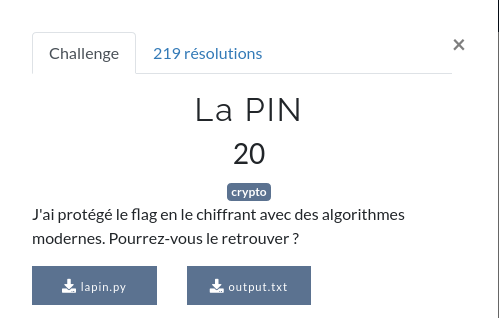
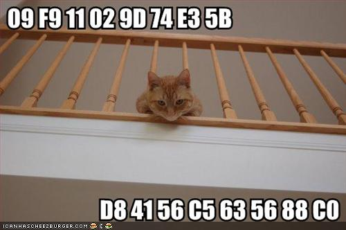

# LaPIN



# Petit tour

Nous avons ici 2 fichiers :
- [lapin.py](ressource/lapin.py)
- [output.txt](ressource/output.txt)

Regardons d'un peu plus près le fichier `output.txt` et le script `lapin.py`

```
f049de59cbdc9189170787b20b24f7426ccb9515e8b0250f3fc0f0c14ed7bb1d4b42c09d02fe01e0973a7233d99af55ce696f599050142759adc26796d64e0d6035f2fc39d2edb8a0797a9e45ae4cd55074cf99158d3a64dc70a7e836e3b30382df30de49ba60a
```

```python
from Crypto.Cipher import AES
from Crypto.Protocol.KDF import scrypt
from Crypto.Util.number import long_to_bytes
import codecs

while True:
	pin = int(input(">>> PIN code (4 digits): "))
	if 0 < pin < 9999:
		break

flag = open("flag.txt", "rb").read()
k = scrypt(long_to_bytes(pin), b"FCSC", 32, N = 2 ** 10, r = 8, p = 1)
aes = AES.new(k, AES.MODE_GCM)
c, tag = aes.encrypt_and_digest(flag)

enc = aes.nonce + c + tag
print(enc.hex())
```

Ce script python utilise un [code PIN](https://fr.wikipedia.org/wiki/Code_PIN) et un chiffrement [AES](https://fr.wikipedia.org/wiki/Advanced_Encryption_Standard).

```python
while True:
	pin = int(input(">>> PIN code (4 digits): "))
	if 0 < pin < 9999:
		break
```

On a ici une boucle infinie qui nous dit que si le [code PIN](https://fr.wikipedia.org/wiki/Code_PIN) saisi est compris entre 0 et 9999 alors on le stock dans une variable et on casse la boucle infinie. Autrement dit, si le nombre saisit est inférieur à 0 ou qu'il est supérieur à 9999, alors on redemande le [code PIN](https://fr.wikipedia.org/wiki/Code_PIN) jusqu'à être dans le bon range.

```python
flag = open("flag.txt", "rb").read()
k = scrypt(long_to_bytes(pin), b"FCSC", 32, N = 2 ** 10, r = 8, p = 1)
aes = AES.new(k, AES.MODE_GCM)
c, tag = aes.encrypt_and_digest(flag)
```

Ici , le script lit un fichier qui contient le flag (`flag.txt`) et on récupère son contenu.
Il crée une clé de chiffrement à partir du [code PIN](https://fr.wikipedia.org/wiki/Code_PIN), du vectieur d'initialisation (IV) qui est `FCSC` ainsi que d'autres paramètres (voir https://docs.python.org/3/library/hashlib.html pour le prototype de la fonction). On se retrouve avec une clé de chiffemeent `k`.
Il initialise un objet [AES](https://fr.wikipedia.org/wiki/Advanced_Encryption_Standard) à partir de la clé créée précédemment.
Il chiffre le contenu de la variable `flag` que l'on récupère dans la variable `c` avec son tag dans `tag` (voir https://tools.ietf.org/html/rfc7714).

```python
enc = aes.nonce + c + tag
print(enc.hex())
```

Il concatène le nonce, la valeur chifrée et le tag.
Il affiche le résultat sous forme hexadécimale.


# Exploitation

Il faut ici retrouver le [code PIN](https://fr.wikipedia.org/wiki/Code_PIN) pour pouvoir recréer la clé qui permettrait de déchiffrer le contenu de `output.txt`.
Oui parce que [AES](https://fr.wikipedia.org/wiki/Advanced_Encryption_Standard) est un [chiffrement symétrique](https://fr.wikipedia.org/wiki/Cryptographie_sym%C3%A9trique). Ce qui veut dire qu'avec la même clé, on peut chiffrer ET déchiffrer une donnée contrairement au [chiffrement saymétrique](https://fr.wikipedia.org/wiki/Cryptographie_asym%C3%A9trique) où 2 clés sont générées. Une clé publique et une clé privée. La publique servant à chiffrer la data et la privée à la déchiffrer.


On va donc créer un script pour bruteforcer le [code PIN](https://fr.wikipedia.org/wiki/Code_PIN) et retrouver le message chiffré :

```python
from Crypto.Cipher import AES
from Crypto.Protocol.KDF import scrypt
from Crypto.Util.number import long_to_bytes
import codecs

output = open("output.txt", "rb").read()[:-1]

nonce = codecs.decode(output[0:32].decode('ascii'), "hex")
ciphertext = codecs.decode(output[32:-32].decode('ascii'), "hex")
mac = codecs.decode(output[-32:].decode('ascii'), "hex")

for x in range(0, 9999):
    k = scrypt(long_to_bytes(x), b"FCSC", 32, N = 2 ** 10, r = 8, p = 1)
    aes = AES.new(k, AES.MODE_GCM, nonce)
    try:
        plaintext = aes.decrypt_and_verify(ciphertext, mac)
    except ValueError:
        continue

    #if plaintext[:4] == "FCSC":
    print("pin : ", x)
    print(plaintext)
```

Explications donc :

```python
from Crypto.Cipher import AES
from Crypto.Protocol.KDF import scrypt
from Crypto.Util.number import long_to_bytes
import codecs
```

On importe ici les librairies dont on a besoin pour manipuler du chiffrement [AES](https://fr.wikipedia.org/wiki/Advanced_Encryption_Standard).

```python
output = open("output.txt", "rb").read()[:-1]
```

On récupère le contenu de `output.txt` moins le caractère de fin (retour à la ligne (\n)).

Quand on regarde le script `lapin.py` on voit qu'on contruit le contenu de `output.txt` avec :

```python
enc = aes.nonce + c + tag
```
On va donc récupérer le `nonce`, `c` et le `tag` (ou le mac, c'est la même valeur) depuis le contenu de `output.txt`:

```python
nonce = codecs.decode(output[0:32].decode('ascii'), "hex")
ciphertext = codecs.decode(output[32:-32].decode('ascii'), "hex")
mac = codecs.decode(output[-32:].decode('ascii'), "hex")
```

Puis, après avoir récupéré tout ça, nous allons bruteforcer le [code PIN](https://fr.wikipedia.org/wiki/Code_PIN) pour récupérer la bonne clé qui nous permettra de déchiffrer le contenu d'`output.txt` :

```python
for x in range(0, 9999):
    k = scrypt(long_to_bytes(x), b"FCSC", 32, N = 2 ** 10, r = 8, p = 1)
    aes = AES.new(k, AES.MODE_GCM, nonce)
    try:
        plaintext = aes.decrypt_and_verify(ciphertext, mac)
    except ValueError:
        continue

    #if plaintext[:4] == "FCSC":
    print("pin : ", x)
    print(plaintext)
```

Donc, pour chaque valeur comprise entre 0 et 9999, nous allons reconstruire une clé de chiffrement avec les mêmes paramètres que le script qui a permis de chiffrer le flag à la base.

Si le message n'a pu être déchiffré parce que la clé n'est pas bonne, une [exception](https://fr.wikipedia.org/wiki/Syst%C3%A8me_de_gestion_d%27exceptions) est lancée.
Si le message a pu être déchiffré, on affiche le [code PIN](https://fr.wikipedia.org/wiki/Code_PIN) qui a pu générer la bonne clé pour déchiffrer le message, et on affiche le flag

Résultat :

```shell
kali@Tyrell:~/FCSC/FCSC2021/intro/LaPIN$ python3 decrypt.py
pin :  6273
b'FCSC{c1feab88e6c6932c57fbaf0c1ff6c32e51f07ae87197fcd08956be4408b2c802}\n'
```

Le flag est donc

```
FCSC{c1feab88e6c6932c57fbaf0c1ff6c32e51f07ae87197fcd08956be4408b2c802}
```


