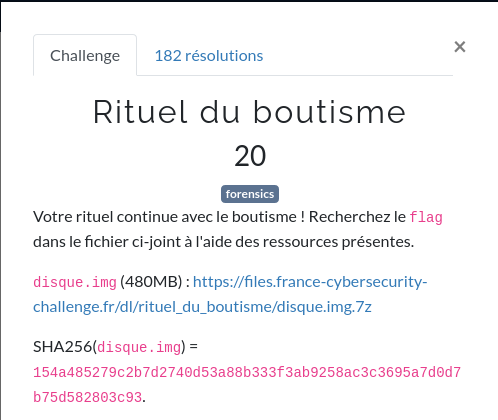
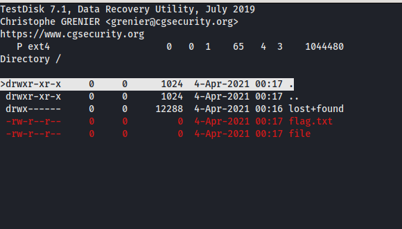
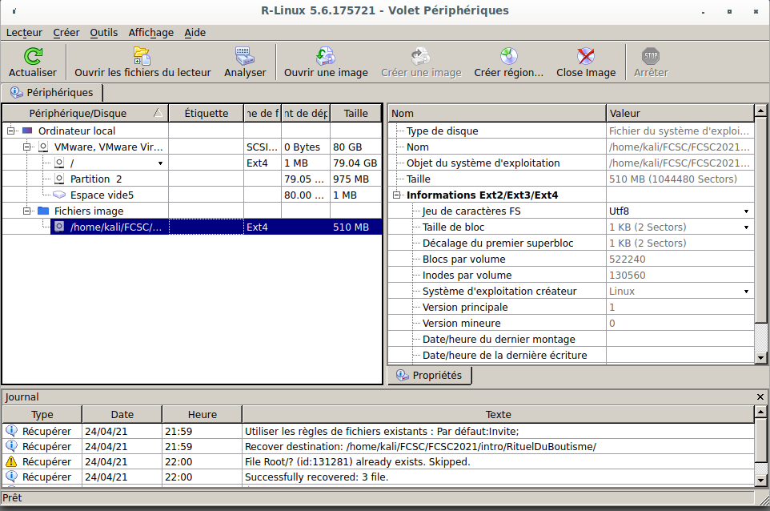
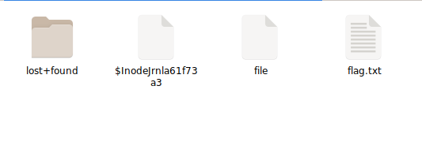

# Rituel du Boutisme



Dans ce challenge, nous avons un dump d'une image disque dans lequel se trouve un flag.

[`disque.img.7z`](ressources/disque.img.7z)

# Analyse

Après avoir décompressé l'archive, on va passer un coup de [Testdisk](https://fr.wikipedia.org/wiki/TestDisk) pour voir ce que cette image disque nous cache.



On voit ici qu'il y a bien 2 fichiers qui ont été effacés :
- flag.txt
- file

Le souci est que ces 2 fichiers font 0 octets. Ils sont vides donc. Comme si le disque avait été formaté. Impossible de les récupérer via [Testdisk](https://fr.wikipedia.org/wiki/TestDisk).

On va donc essayer d'utiliser un autre outil de récupération de fichiers : `RLinux`



On lance l'analyse sur le fichier image (.img) et récupérer les fichiers qui sont dessus.

On voit ici que 3 fichiers ont été récupérés (j'ai placé ces fichiers dans un répertoire que j'ai nommé `Root`).

À l'intérieur de ce dossier, nous avons récupéré les 2 fichiers qui avaient 0 octets dans [Testdisk](https://fr.wikipedia.org/wiki/TestDisk).



Et si on affiche le contenu de `flag.txt`

```shell
kali@Tyrell:~/FCSC/FCSC2021/intro/RituelDuBoutisme/Root$ cat flag.txt
FCSC{6a8024a83d9ec2d1a9c36c51d0408f15836a043ae0431626987ce2b8960a5937}
```

On a donc le flag

```
FCSC{6a8024a83d9ec2d1a9c36c51d0408f15836a043ae0431626987ce2b8960a5937}
```


