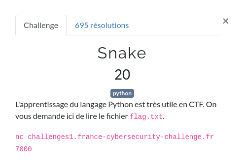

# Snake



## Présentation

Le but de ce challenge est de faire une brève introduction à Python en allant lire un fichier sur le disque.

Les devs Python.... Je vous vois hein...

Pour ce faire, il suffit donc de se connecter (ici avec netcat) au serveur sur lequel nous allons tenter de lire le super fichier `flag.txt`.

```shell
nc challenges1.france-cybersecurity-challenge.fr 7000
```

## Échauffement

Du coup, on tape les instructions magiques dans le langage du serpent le plus connu des développeurs pour aller lire notre petit fichier.

```shell
>>> import os
>>> arr = os.listdir()
>>> print (arr)
['flag.txt']
>>> print(open("flag.txt", "r").read())
FCSC{d6125af647740672b2899a2ee563a011755ba0d665e852fb360614dd52418d60}
```

### Explications

```shell
>>> import os
```
 Ici, on va importer le package `os` qui contient les méthodes permettant d'appeler diverses fonctions pour manipuler tout ce qui est système.

 ```shell
 >>> arr = os.listdir()
 ```
 Ensuite, on va stocker la liste des fichiers présents dans le répertoire courant.

 ```shell
 >>> print (arr)
 ['flag.txt']
 ```
 On affiche le résultat. On récupère un tableau avec la liste des fichiers/répertoires présents dans le répertoire courant.

 Du coup le fichier `flag.txt` est bien présent ici.

 ```shell
 >>> print(open("flag.txt", "r").read())
 ```
On affiche le résultat du contenu du fichier.


### Résultat

```shell
FCSC{d6125af647740672b2899a2ee563a011755ba0d665e852fb360614dd52418d60}
```


## Références

[1] https://docs.python.org/fr/3/library/os.html
