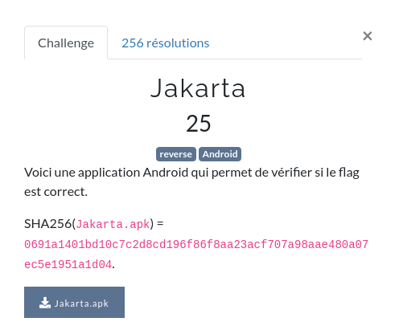

# Jakarta




# Présentation

Dans ce challenge, nous avons à disposition un fichier [APK](https://fr.wikipedia.org/wiki/APK_(format_de_fichier)) (une application [Android](https://fr.wikipedia.org/wiki/Android))

- [`Jakarta.apk`](ressources/Jakarta.apk)

Le flag se trouve quelque part dans cet [APK](https://fr.wikipedia.org/wiki/APK_(format_de_fichier)).

Pour pouvoir le trouver, nous avons besoin de décompiler l'[APK](https://fr.wikipedia.org/wiki/APK_(format_de_fichier)) pour revenir sur du code source [Java](https://fr.wikipedia.org/wiki/Java_(langage)).

[Android](https://fr.wikipedia.org/wiki/Android) utilise la machine virtuelle [Dalvik](https://fr.wikipedia.org/wiki/Dalvik_(machine_virtuelle)) pour executer du [bytecode Java](https://fr.wikipedia.org/wiki/Bytecode_Java) au format Dex.

Il faut donc décompiler le fichier [APK](https://fr.wikipedia.org/wiki/APK_(format_de_fichier)) en fichier [JAR](https://fr.wikipedia.org/wiki/JAR_(format_de_fichier)) pour pouvoir passer du [JAR](https://fr.wikipedia.org/wiki/JAR_(format_de_fichier)) au langage [Java](https://fr.wikipedia.org/wiki/Java_(langage)).

Pour cela, il nous faut 2 outils :
- `d2j-dex2jar` pour passer de l'[APK](https://fr.wikipedia.org/wiki/APK_(format_de_fichier)) au [JAR](https://fr.wikipedia.org/wiki/JAR_(format_de_fichier))
- `jadx` pour passer du [JAR](https://fr.wikipedia.org/wiki/JAR_(format_de_fichier)) au [Java](https://fr.wikipedia.org/wiki/Java_(langage)).

```shell
kali@Tyrell:~/FCSC/FCSC2021/reverse/jakarta$ mkdir jakarta_sources
kali@Tyrell:~/FCSC/FCSC2021/reverse/jakarta$ /usr/bin/d2j-dex2jar Jakarta.apk
kali@Tyrell:~/FCSC/FCSC2021/reverse/jakarta$ jadx -ds jakarta_sources/ Jakarta-dex2jar.jar
kali@Tyrell:~/FCSC/FCSC2021/reverse/jakarta$ cd jakarta_sources
kali@Tyrell:~/FCSC/FCSC2021/reverse/jakarta/jakarta_sources$ ls
android  androidx  com  defpackage  resources
kali@Tyrell:~/FCSC/FCSC2021/reverse/jakarta/jakarta_sources$ cd com/fcsc2021/
kali@Tyrell:~/FCSC/FCSC2021/reverse/jakarta/jakarta_sources/com/fcsc2021$ tree
.
└── jakarta
    ├── BuildConfig.java
    ├── Check.java
    ├── MainActivity.java
    └── R.java

1 directory, 4 files
```

Nous voyons ici la classe `MainActivity.java`, point d'entrée de l'application, et le fichier`Check.java` qui pourrait contenir le calcul du flag.
Regardons le fichier `Check.java`

```java
package com.fcsc2021.jakarta;

public class Check {
    int[] enc = {11, 152, 177, 51, 145, 152, 153, 185, 26, 156, 177, 19, 177, 50, 156, 26, 156, 35, 176, 159, 185, 185, 185, 26, 19, 152, 177, 50, 144, 144, 176, 177, 26, 184, 190, 50, 11, 26, 51, 26, 26, 156, 19, 58, 148, 19, 176, 51, 26, 177, 58, 58, 144, 139, 152, 50, 185, 153, 177, 153, 144, 26, 176, 144, 50, 156, 145, 153, 156, 156};
    String flag;

    public Check(String str) {
        this.flag = str;
    }

    public boolean valid() {
        int length = this.flag.length();
        if (length != this.enc.length) {
            return false;
        }
        int[] iArr = new int[length];
        for (int i = 0; i < length; i++) {
            char charAt = this.flag.charAt(((i * 37) + 1) % length);
            for (int i2 = 7; i2 >= 0; i2--) {
                iArr[i] = iArr[i] ^ (((charAt >> i2) & 1) << (((i2 * 5) + 3) % 8));
            }
        }
        int i3 = 0;
        for (int i4 = 0; i4 < length; i4++) {
            i3 |= iArr[i4] ^ this.enc[i4];
        }
        return i3 == 0;
    }
}
```

Nous avons un tableau `enc` qui contient une liste de valeurs décimales :

```java
int[] enc = {11, 152, 177, 51, 145, 152, 153, 185, 26, 156, 177, 19, 177, 50, 156, 26, 156, 35, 176, 159, 185, 185, 185, 26, 19, 152, 177, 50, 144, 144, 176, 177, 26, 184, 190, 50, 11, 26, 51, 26, 26, 156, 19, 58, 148, 19, 176, 51, 26, 177, 58, 58, 144, 139, 152, 50, 185, 153, 177, 153, 144, 26, 176, 144, 50, 156, 145, 153, 156, 156};
```

Nous avons une méthode `valid` qui compare une chaîne de caractères à des éléments ordonnées du tableau `enc`.

```java
public boolean valid() {
    int length = this.flag.length();
    if (length != this.enc.length) {
        return false;
    }
    int[] iArr = new int[length];
    for (int i = 0; i < length; i++) {
        char charAt = this.flag.charAt(((i * 37) + 1) % length);
        for (int i2 = 7; i2 >= 0; i2--) {
            iArr[i] = iArr[i] ^ (((charAt >> i2) & 1) << (((i2 * 5) + 3) % 8));
        }
    }
    int i3 = 0;
    for (int i4 = 0; i4 < length; i4++) {
        i3 |= iArr[i4] ^ this.enc[i4];
    }
    return i3 == 0;
}
```

Dans la première boucle, une opération récupère l'index du caractère à prendre dans la chaîne de caractères en entrée (`((i*37) +1) % length`, `lenght` étant la taille de la chaîne de caractères d'entrée ET du tableau).

Le tableau `enc` n'est donc pas ordonné de manière contigüe.

```java
char charAt = this.flag.charAt(((i * 37) + 1) % length);
```

Dans la 2eme boucle, des [opérations bit à bit](https://fr.wikipedia.org/wiki/Op%C3%A9ration_bit_%C3%A0_bit) sont faites pour stocker cette valeur dans un autre tableau.

```java
for (int i2 = 7; i2 >= 0; i2--) {
    iArr[i] = iArr[i] ^ (((charAt >> i2) & 1) << (((i2 * 5) + 3) % 8));
}
```

Dans la dernière boucle, l'opération [XOR](https://fr.wikipedia.org/wiki/Fonction_OU_exclusif) est executée à chaque tour de boucle entre les valeurs contenues dans le tableau construit précédemment et la liste `enc`.

# Retrouvons le flag !

Nous allons donc écrire un script pour retrouver quel flag se cache derrière cette liste.

```python
# /usr/bin/env python3
# decode.py

enc = [11, 152, 177, 51, 145, 152, 153, 185, 26, 156, 177, 19, 177, 50, 156, 26, 156, 35, 176, 159, 185, 185, 185, 26, 19, 152, 177, 50, 144, 144, 176, 177, 26, 184, 190, 50, 11, 26, 51, 26, 26, 156, 19, 58, 148, 19, 176, 51, 26, 177, 58, 58, 144, 139, 152, 50, 185, 153, 177, 153, 144, 26, 176, 144, 50, 156, 145, 153, 156, 156]
init = ['0', '1', '2', '3', '4', '5', '6', '7', '8', '9', 'a', 'b', 'c', 'd', 'e', 'f', 'F', 'C', 'S', '{', '}']
flag = ""
index = 0
for j in range(0, len(enc)):
    for k in range(0, len(enc)):
        if (((k * 37)+1) % 70) == j:
            index = k
            break

    for i in range(0, len(init)):
        a = 0
        char = ord(init[i])
        for i2 in range(7, -1, -1):
            a = a ^ (((char >> i2) & 1) << (((i2 * 5) + 3) % 8))

        xor = a ^ enc[index]
        if xor == 0:
            flag = flag+init[i]
            break
print(flag)
```

On récupère le tableau `enc`. On crée aussi un tableau avec tous les caractères possibles du flag (les caractères hexadécimaux avec 'F', 'C', 'S', '{' et'}')

## Explication du script
Ce script dit :
- Pour chaque caractère du flag :
    - On récupère la position du caractère courant encodé dans le tableau `enc`
    - Pour chaque élément du tableau `init` de caractères possibles :
        - On récupère le code [ASCII](https://fr.wikipedia.org/wiki/American_Standard_Code_for_Information_Interchange) de ce caractère
        - On y applique les mêmes [opérations bit à bit](https://fr.wikipedia.org/wiki/Op%C3%A9ration_bit_%C3%A0_bit) que dans le script de Check.
        - On applique l'opération [XOR](https://fr.wikipedia.org/wiki/Fonction_OU_exclusif) entre le résultat de l'opération précédente et le chiffre entier du tableau `enc` de la position calculée dans la seconde boucle.
        - Si le résultat du [XOR](https://fr.wikipedia.org/wiki/Fonction_OU_exclusif) est égale à 0, alors nous avons trouvé notre caractère, et on la concatène dans une chaîne de caractères qui contiendra le flag.
- On affiche le résultat du flag

## Résultat

On obtient donc la preuve d'execution suivante :

```shell
kali@Tyrell:~/FCSC/FCSC2021/reverse/jakarta$ python decode.py
FCSC{6df723aa33b1aa8d604069a693e5990d411a7f7a7169b70e694b0bdf4d26aa9e}
```


